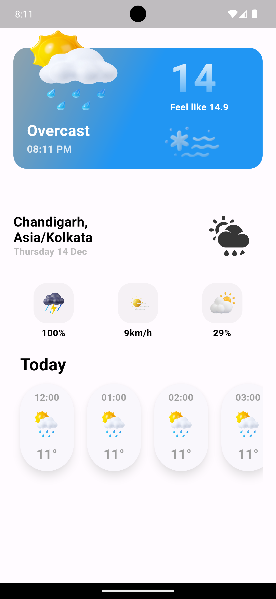

# Flutter Weather Application

## Introduction

This Flutter weather application is designed to provide users with accurate weather information in an intuitive and user-friendly way. It fetches data from a weather API to display the current weather details, a complete 24-hour forecast, and a 14-day weather forecast. The app is built using the MVVM architecture and managed with the GetX state management library, ensuring a clean and maintainable codebase.

## Screenshots

## Architecture

The app is built using the Model-View-ViewModel (MVVM) architecture. This design pattern separates the concerns of data, UI, and business logic, leading to a more modular and testable codebase. The app's architecture is further enhanced by GetX, a state management library that simplifies reactive programming and state transitions.

## Getting Started

Follow these steps to get the app up and running:

1. Clone the repository: `git clone [https://github.com/Hamad-Anwar/Flutter-Weather-With-APIs-GETX-MVVM.git](https://github.com/impossibleshadowstorm/flutter-weather-application)`
2. Navigate to the project directory.
3. Install dependencies: `flutter pub get`
4. Run the app: `flutter run`

## API Integration

The app integrates with a weather API to fetch weather data. The API key should be placed in the `lib/data/network/api_services.dart` file. You can obtain an API key by signing up on the weather service's website.

For a complete list of dependencies, check the `pubspec.yaml` file.

